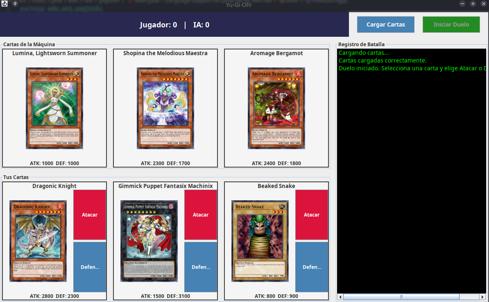
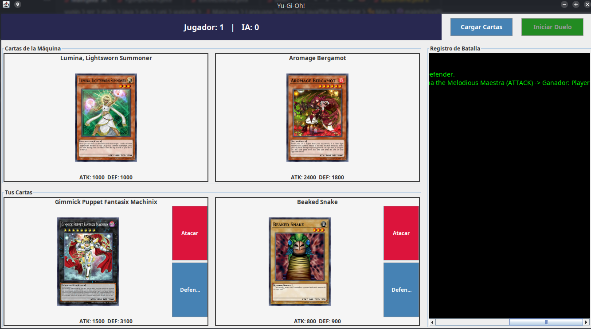
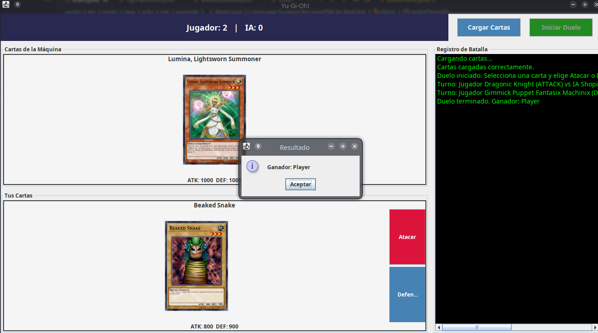
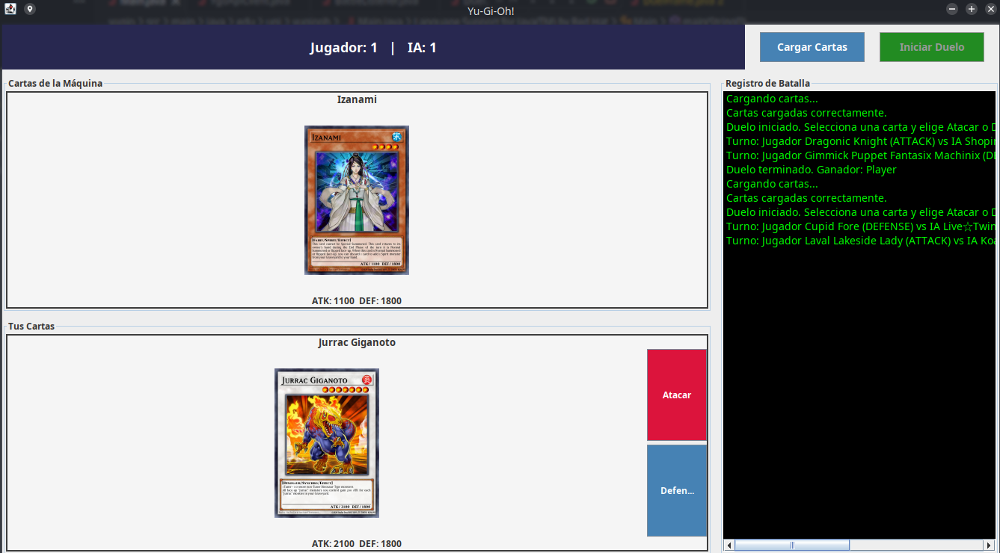
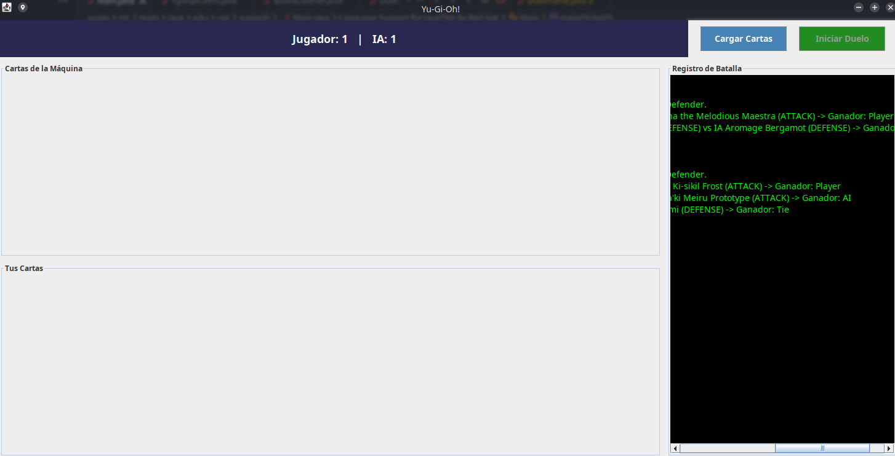

# LaboratorioDS3

# Instalacion
Descargar el proyecto, hacer un build y correr la clase main yDisfrutar

# Explicación

Este proyecto implementa una versión simplificada de un duelo de **Yu-Gi-Oh!** en Java, utilizando la API pública de **YGOProDeck** para obtener cartas aleatorias. La clase `YgoApiClient` se encarga de conectarse al servicio web, procesar la respuesta en formato JSON y devolver únicamente cartas de tipo "Monster" con su nombre, ataque, defensa e imagen. Estas cartas se encapsulan en la clase `Card`, que actúa como modelo de datos dentro del programa.

El flujo del juego se maneja en la clase `Duel`, que define la lógica del combate comparando valores de ATK y DEF según la posición elegida (ataque o defensa). La interfaz `BattleListener` sirve como puente entre la lógica y la interfaz gráfica (`DuelFrame`), la cual está desarrollada con **Swing**. `DuelFrame` permite cargar cartas, mostrarlas en pantalla con sus imágenes y estadísticas, y ejecutar turnos de batalla entre el jugador y la IA, actualizando puntajes y mostrando el resultado final en un entorno visual amigable.

# Imagenes

Elegimos la carta, si queremos atacar o defender

ya atacamos con la carta a otra carta aleatoria

cuando ganas :D

La IA tambien ataca o puede ganar

Caso muy raro donde se empatan